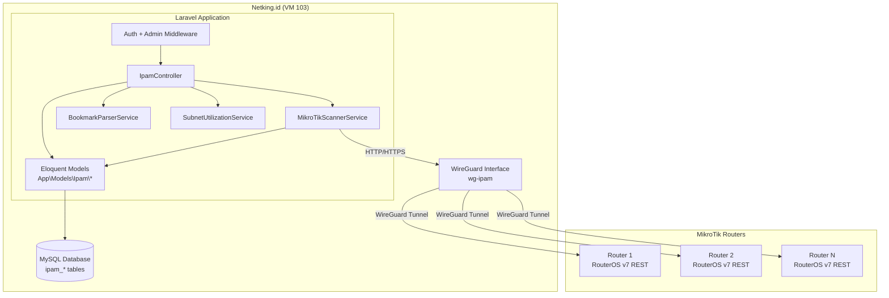

# Design Document: IPAM Integration

## Overview

This design migrates the standalone Netking IP Manager (CT 100, Docker/Laravel) into the main Netking.id admin panel (VM 103). The integration replaces a separate service with an embedded module that uses the same MySQL database, session authentication, and Blade UI framework already in use by Netking.id.

The IPAM module connects to MikroTik routers via RouterOS v7 REST API over WireGuard tunnels to discover IP pools, addresses, routes, and WireGuard configuration. It also manages a registry of OLTs (imported from browser bookmarks), maps routers to OLTs, tracks subnets with utilization calculations, and maintains a full audit trail.

**Key design decisions:**
- All tables prefixed `ipam_` to avoid conflicts (especially with existing `olts` table)
- Models namespaced under `App\Models\Ipam` for isolation
- Service layer (`MikroTikScannerService`) encapsulates all RouterOS API logic
- Reuses existing `Setting` model with `ipam.` key prefix for configuration
- No new authentication — leverages existing `auth` + `admin` middleware
- Blade views follow the established `ms-page > ms-panel > ms-table-shell` pattern

## Architecture



### Request Flow

1. Admin navigates to IPAM section → `auth` + `admin` middleware validate session
2. Controller action invoked → delegates to appropriate service
3. Service performs business logic (scanning, parsing, calculating)
4. Results stored via Eloquent models → MySQL `ipam_*` tables
5. Audit log entry recorded for all data-modifying operations
6. Blade view rendered with data

### Route Structure

All IPAM routes live under the `admin/ipam` prefix, grouped with `auth` and `admin` middleware:

```
admin/ipam/                        → Dashboard
admin/ipam/routers                 → Router list (explorer)
admin/ipam/routers/{id}            → Router detail (pools, addresses, WireGuard)
admin/ipam/routers/{id}/scan       → Trigger single scan (POST)
admin/ipam/routers/scan-all        → Trigger bulk scan (POST)
admin/ipam/routers/export-csv      → CSV export (GET)
admin/ipam/routers/{id}/map-olt    → Update OLT mapping (POST)
admin/ipam/routers/auto-map        → Auto-map all routers (POST)
admin/ipam/olts                    → OLT list + CRUD
admin/ipam/olts/import-bookmarks   → Bookmark import (POST)
admin/ipam/subnets                 → Subnet list + CRUD
admin/ipam/subnets/utilization     → Utilization data (GET, JSON)
admin/ipam/subnets/suggestions     → Available space suggestions (GET, JSON)
admin/ipam/audit-log               → Audit log viewer
admin/ipam/settings                → MikroTik connection settings
```

## Components and Interfaces

### Controllers

**`App\Http\Controllers\Admin\IpamController`**

Single controller handling all IPAM routes (consistent with the app's existing pattern of feature-scoped controllers):

```php
class IpamController extends Controller
{
    public function __construct(
        private MikroTikScannerService $scanner,
        private BookmarkParserService $bookmarkParser,
        private SubnetUtilizationService $subnetService,
    ) {}

    // Dashboard
    public function dashboard(): View;

    // Router Explorer
    public function routers(Request $request): View;
    public function routerDetail(IpamRouter $router): View;
    public function scanRouter(IpamRouter $router): RedirectResponse;
    public function scanAll(): RedirectResponse;
    public function exportCsv(): StreamedResponse;
    public function mapOlt(Request $request, IpamRouter $router): RedirectResponse;
    public function autoMap(): RedirectResponse;

    // OLT Management
    public function olts(Request $request): View;
    public function storeOlt(Request $request): RedirectResponse;
    public function updateOlt(Request $request, IpamOlt $olt): RedirectResponse;
    public function destroyOlt(IpamOlt $olt): RedirectResponse;
    public function importBookmarks(Request $request): RedirectResponse;

    // Subnet Management
    public function subnets(Request $request): View;
    public function storeSubnet(Request $request): RedirectResponse;
    public function updateSubnet(Request $request, IpamSubnet $subnet): RedirectResponse;
    public function destroySubnet(IpamSubnet $subnet): RedirectResponse;
    public function subnetUtilization(): JsonResponse;
    public function subnetSuggestions(Request $request): JsonResponse;

    // Audit Log
    public function auditLog(Request $request): View;

    // Settings
    public function settings(): View;
    public function updateSettings(Request $request): RedirectResponse;
}
```

### Services

**`App\Services\Ipam\MikroTikScannerService`**

Encapsulates all RouterOS REST API communication and scan orchestration:

```php
class MikroTikScannerService
{
    public function scanRouter(IpamRouter $router): ScanResult;
    public function scanAll(int $concurrency = 8): Collection;
    public function canScan(IpamRouter $router): bool; // cooldown check
    public function healthCheck(IpamRouter $router): bool;

    // Internal: API calls to RouterOS
    private function fetchIpPools(IpamRouter $router): array;
    private function fetchAddresses(IpamRouter $router): array;
    private function fetchRoutes(IpamRouter $router): array;
    private function fetchWireguardInterfaces(IpamRouter $router): array;
    private function fetchWireguardPeers(IpamRouter $router): array;
    private function buildHttpClient(IpamRouter $router): PendingRequest;
}
```

The service uses Laravel's `Http` facade (Guzzle wrapper) with configuration from `Setting::get('ipam.*')`:
- Base URL: `{scheme}://{wireguard_ip}/rest`
- Auth: HTTP Basic with per-router credentials or defaults from settings
- Timeout: configurable via `ipam.request_timeout_secs`
- SSL verification: disabled when `ipam.allow_insecure_tls` is true

**`App\Services\Ipam\BookmarkParserService`**

Parses Netscape-format HTML bookmark exports:

```php
class BookmarkParserService
{
    public function parse(string $htmlContent): Collection; // Returns [{name, ip_address}]
    public function importToDatabase(Collection $entries, string $actor): ImportResult;
}
```

Parsing logic: Extract `<A HREF="...">` tags, parse hostname/IP from URL, skip duplicates against existing `ipam_olts`.

**`App\Services\Ipam\SubnetUtilizationService`**

Calculates subnet usage and finds available space:

```php
class SubnetUtilizationService
{
    public function calculateUtilization(IpamSubnet $subnet): UtilizationResult;
    public function findAvailableSpace(IpamSubnet $subnet): Collection;
    public function calculateAll(): Collection; // All subnets with utilization
}
```

Utilization calculation:
1. Compute total usable IPs from network_address/prefix_length (excluding network + broadcast)
2. Count IPs used by: router addresses within subnet range + IP pool ranges within subnet
3. Return percentage = (used / total) × 100

**`App\Services\Ipam\IpamAuditService`**

Thin helper for consistent audit logging:

```php
class IpamAuditService
{
    public static function log(string $action, string $targetType, ?int $targetId, string $detail): void;
}
```

Auto-captures the authenticated admin username as actor.

### Artisan Commands

| Command | Purpose |
|---------|---------|
| `ipam:migrate-data` | One-time SQLite → MySQL data migration |
| `ipam:verify` | Post-migration verification checklist |

## Data Models

### Entity Relationship Diagram

```mermaid
erDiagram
    ipam_routers ||--o{ ipam_ip_pools : "has many"
    ipam_routers ||--o{ ipam_router_addresses : "has many"
    ipam_routers ||--o{ ipam_router_routes : "has many"
    ipam_routers ||--o{ ipam_wireguard_interfaces : "has many"
    ipam_routers ||--o{ ipam_wireguard_peers : "has many"
    ipam_routers }o--o| ipam_olts : "mapped to"

    ipam_routers {
        bigint id PK
        string device_name
        string wireguard_ip UK
        string auth_username nullable
        text auth_password nullable "encrypted"
        string auth_source nullable
        string connection_status "default: unknown"
        text last_error nullable
        timestamp last_scanned_at nullable
        bigint mapped_olt_id FK nullable
        boolean is_online nullable
        timestamp last_ping_at nullable
        timestamps created_at_updated_at
    }

    ipam_olts {
        bigint id PK
        string name UK
        string ip_address UK
        timestamps created_at_updated_at
    }

    ipam_ip_pools {
        bigint id PK
        bigint router_id FK
        string pool_name
        string ranges
        timestamps created_at_updated_at
        unique router_id_pool_name
    }

    ipam_router_addresses {
        bigint id PK
        bigint router_id FK
        string address
        string network
        string interface
        boolean disabled "default: false"
        string comment nullable
        timestamps created_at_updated_at
    }

    ipam_router_routes {
        bigint id PK
        bigint router_id FK
        string dst_address
        string gateway
        string distance nullable
        boolean disabled "default: false"
        string comment nullable
        timestamps created_at_updated_at
    }

    ipam_wireguard_interfaces {
        bigint id PK
        bigint router_id FK
        string name
        string listen_port nullable
        string public_key nullable
        boolean disabled "default: false"
        string comment nullable
        timestamps created_at_updated_at
        unique router_id_name
    }

    ipam_wireguard_peers {
        bigint id PK
        bigint router_id FK
        string interface_name
        string public_key
        string allowed_address
        string endpoint_address nullable
        string endpoint_port nullable
        boolean disabled "default: false"
        string comment nullable
        timestamps created_at_updated_at
    }

    ipam_subnets {
        bigint id PK
        string network_address UK
        integer prefix_length
        string name nullable
        string description nullable
        string vlan_id nullable
        string location nullable
        timestamps created_at_updated_at
    }

    ipam_audit_logs {
        bigint id PK
        string actor
        string action
        string target_type
        string target_id nullable
        text detail
        timestamp created_at
    }
```

### Model Definitions

All models use namespace `App\Models\Ipam` and extend `Illuminate\Database\Eloquent\Model`.

**IpamRouter:**
- Table: `ipam_routers`
- Casts: `auth_password` → `encrypted`, `is_online` → `boolean`, `last_scanned_at` → `datetime`, `last_ping_at` → `datetime`
- Relationships: `hasMany(IpamIpPool)`, `hasMany(IpamRouterAddress)`, `hasMany(IpamRouterRoute)`, `hasMany(IpamWireguardInterface)`, `hasMany(IpamWireguardPeer)`, `belongsTo(IpamOlt, 'mapped_olt_id')`
- Fillable: all fields except `id`

**IpamOlt:**
- Table: `ipam_olts`
- Relationships: `hasMany(IpamRouter, 'mapped_olt_id')`
- Fillable: `name`, `ip_address`

**IpamIpPool:**
- Table: `ipam_ip_pools`
- Relationships: `belongsTo(IpamRouter, 'router_id')`
- Fillable: `router_id`, `pool_name`, `ranges`

**IpamRouterAddress:**
- Table: `ipam_router_addresses`
- Casts: `disabled` → `boolean`
- Relationships: `belongsTo(IpamRouter, 'router_id')`
- Fillable: `router_id`, `address`, `network`, `interface`, `disabled`, `comment`

**IpamRouterRoute:**
- Table: `ipam_router_routes`
- Casts: `disabled` → `boolean`
- Relationships: `belongsTo(IpamRouter, 'router_id')`
- Fillable: `router_id`, `dst_address`, `gateway`, `distance`, `disabled`, `comment`

**IpamWireguardInterface:**
- Table: `ipam_wireguard_interfaces`
- Casts: `disabled` → `boolean`
- Relationships: `belongsTo(IpamRouter, 'router_id')`
- Fillable: `router_id`, `name`, `listen_port`, `public_key`, `disabled`, `comment`

**IpamWireguardPeer:**
- Table: `ipam_wireguard_peers`
- Casts: `disabled` → `boolean`
- Relationships: `belongsTo(IpamRouter, 'router_id')`
- Fillable: `router_id`, `interface_name`, `public_key`, `allowed_address`, `endpoint_address`, `endpoint_port`, `disabled`, `comment`

**IpamSubnet:**
- Table: `ipam_subnets`
- Fillable: `network_address`, `prefix_length`, `name`, `description`, `vlan_id`, `location`

**IpamAuditLog:**
- Table: `ipam_audit_logs`
- `$timestamps = false` (only `created_at` managed manually)
- Fillable: `actor`, `action`, `target_type`, `target_id`, `detail`, `created_at`

### Settings Keys (stored in existing `settings` table)

| Key | Default | Description |
|-----|---------|-------------|
| `ipam.mikrotik_username` | _(empty)_ | Default router username |
| `ipam.mikrotik_password` | _(empty)_ | Default router password (encrypted in settings) |
| `ipam.use_https` | `false` | Use HTTPS for RouterOS API |
| `ipam.allow_insecure_tls` | `true` | Allow self-signed certs |
| `ipam.request_timeout_secs` | `20` | HTTP request timeout |
| `ipam.max_scan_concurrency` | `8` | Max concurrent bulk scans |
| `ipam.scan_cooldown_secs` | `20` | Minimum seconds between scans of same router |

## Correctness Properties

*A property is a characteristic or behavior that should hold true across all valid executions of a system — essentially, a formal statement about what the system should do. Properties serve as the bridge between human-readable specifications and machine-verifiable correctness guarantees.*

### Property 1: Data Migration Preserves Records

*For any* set of valid IPAM records in the source SQLite database, running the `ipam:migrate-data` command should produce equivalent records in the MySQL `ipam_*` tables with all field values preserved (converting string timestamps to proper datetime columns).

**Validates: Requirements 1.5**

### Property 2: Password Encryption Round-Trip

*For any* non-empty password string stored on an IpamRouter's `auth_password` field, retrieving the field via the model should return the original plaintext value, while the raw database column value should differ from the plaintext.

**Validates: Requirements 2.4**

### Property 3: Scan Data Parsing Correctness

*For any* valid RouterOS REST API response containing IP pools, addresses, routes, and WireGuard configuration, the `MikroTikScannerService` should parse and store exactly the same number of entities as present in the response, with all field values correctly mapped.

**Validates: Requirements 3.2**

### Property 4: Scan Cooldown Enforcement

*For any* IpamRouter that was scanned within the configured cooldown period, a subsequent scan request should be rejected (return false from `canScan`). Scans attempted after the cooldown period has elapsed should be allowed.

**Validates: Requirements 3.6**

### Property 5: Bookmark Parsing Extracts All IPs

*For any* valid Netscape-format HTML bookmark file containing N bookmark entries with parseable IP addresses, the `BookmarkParserService` should extract exactly N entries with correct name and IP address pairs.

**Validates: Requirements 4.2**

### Property 6: Bookmark Import Idempotency

*For any* set of bookmark entries, importing them into the database twice should result in the same total number of IpamOlt records as importing once — duplicate IP addresses are skipped on subsequent imports.

**Validates: Requirements 4.3**

### Property 7: Auto-Mapping Matches by IP Pattern

*For any* set of IpamRouters with interface addresses and IpamOlts with IP addresses, the auto-mapping algorithm should only create mappings where a router's interface address range contains or overlaps with the OLT's IP address. No router should be mapped to an OLT with no IP overlap.

**Validates: Requirements 5.2**

### Property 8: Subnet Uniqueness Enforcement

*For any* network_address value, attempting to create a second IpamSubnet with the same network_address should fail with a validation/constraint error, and the database should contain exactly one record with that network_address.

**Validates: Requirements 6.2**

### Property 9: Subnet Utilization Calculation Correctness

*For any* valid subnet (network_address/prefix_length) and any set of router addresses and IP pool ranges, the utilization percentage should equal the count of IPs within the subnet that are covered by addresses or pool ranges, divided by the total usable IPs in the subnet, times 100.

**Validates: Requirements 6.3**

### Property 10: Subnet Suggestions Return Only Unallocated Space

*For any* subnet and any set of existing allocations (router addresses + IP pool ranges), all suggested available addresses should be: (a) within the subnet's address range, and (b) not overlapping with any existing allocation.

**Validates: Requirements 6.4**

### Property 11: All Data-Modifying Operations Create Audit Log

*For any* data-modifying IPAM operation (create, update, delete, scan, import, map), executing the operation should result in at least one new `ipam_audit_logs` record with the correct action type, target_type, target_id, and a non-empty detail string.

**Validates: Requirements 8.1**

### Property 12: CSV Export Contains All Routers

*For any* set of N IpamRouter records in the database (with or without mapped OLTs), the CSV export should produce exactly N data rows (plus header), each containing the router's device_name, wireguard_ip, connection_status, mapped OLT name (or empty), IP pools summary, and last_scanned_at.

**Validates: Requirements 9.1, 9.2**

### Property 13: Audit Log Never Contains Passwords

*For any* settings update operation that includes a password field change, the resulting IpamAuditLog detail field should NOT contain the actual password value (neither plaintext nor the encrypted ciphertext).

**Validates: Requirements 12.3**

## Error Handling

### RouterOS API Errors

| Error Type | Handling | User Feedback |
|------------|----------|---------------|
| Connection timeout | Set `connection_status = 'error'`, store timeout message in `last_error` | Flash message: "Router {name} tidak merespon (timeout)" |
| Authentication failure (401/403) | Set `connection_status = 'error'`, store auth error in `last_error` | Flash message: "Autentikasi gagal untuk router {name}" |
| Invalid response (malformed JSON) | Set `connection_status = 'error'`, log raw response | Flash: "Response tidak valid dari router {name}" |
| SSL/TLS error | Set `connection_status = 'error'`, suggest enabling insecure TLS | Flash: "Koneksi TLS gagal — aktifkan 'Allow Insecure TLS' jika menggunakan self-signed cert" |
| Cooldown active | Reject scan, no state change | Flash: "Router {name} baru di-scan {N} detik lalu, tunggu {remaining}s" |

### Bulk Scan Errors

During bulk scan, individual router failures do NOT abort the batch. Results are collected and summarized:
- Success count + error count displayed after completion
- Each failed router has its error recorded in `last_error`
- Flash message: "Bulk scan selesai: {success} berhasil, {errors} gagal"

### Data Validation Errors

- Subnet: validate `network_address` is valid CIDR notation, `prefix_length` between 1-32
- OLT: validate `ip_address` is valid IPv4
- Router: validate `wireguard_ip` is valid IPv4, unique
- Bookmark import: skip malformed entries silently, report count of skipped entries

### Database Errors

- Duplicate key violations (subnet network_address, OLT ip_address) → caught and shown as user-friendly validation error
- Foreign key violations → should not occur due to cascadeOnDelete, but caught with generic error message

## Testing Strategy

### Property-Based Testing

This feature is suitable for property-based testing. The core logic involves:
- Data transformations (parsing RouterOS responses, parsing bookmarks, CSV serialization)
- Mathematical calculations (subnet utilization, available space identification)
- Invariant enforcement (cooldown, uniqueness, audit trail completeness)
- Round-trip operations (password encryption, data migration)

**Library:** [Pest PHP](https://pestphp.com/) with the `pestphp/pest-plugin-faker` for data generation, combined with custom generators using `faker` for IP addresses, subnet ranges, and RouterOS response structures.

**Configuration:** Minimum 100 iterations per property test.

**Tag format:** `Feature: ipam-integration, Property {N}: {title}`

### Unit Tests (Example-Based)

| Area | Tests |
|------|-------|
| Controller authorization | Non-admin users receive 403 on all IPAM routes |
| OLT CRUD | Create, read, update, delete with specific examples |
| Settings page | Save and retrieve MikroTik settings |
| Dashboard stats | Correct counts with known data |
| Router detail view | Displays WireGuard interfaces and peers |
| Scan state transitions | connected → error → connected flow |

### Integration Tests

| Area | Tests |
|------|-------|
| MikroTik API communication | Mock HTTP responses simulating real RouterOS v7 REST output |
| Bulk scan concurrency | Verify max concurrent requests honored (with HTTP mock) |
| SQLite data migration | Full migration of sample SQLite database |
| Verification command | `ipam:verify` output with test data |

### What Is NOT Tested with PBT

- UI rendering (Blade templates) → visual review + Dusk smoke tests if needed
- Sidebar visibility → example-based authorization test
- WireGuard network connectivity → manual verification during deployment
- Database migration schema creation → smoke test (run migration, check tables exist)
